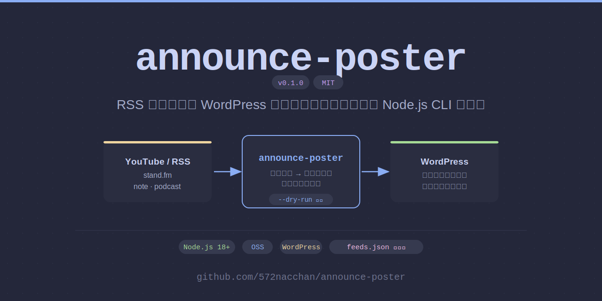

# announce-poster



YouTube・RSSフィードの新着を検知して、WordPressに「お知らせ」下書きを自動生成するツールです。

## 特徴

- **YouTube対応**: チャンネルIDを設定するだけ。サムネイルを自動取得・アップロード
- **RSS汎用対応**: stand.fm・note・ポッドキャストなどRSSがあれば何でも使える
- **og:image自動取得**: RSSフィードの記事URLからサムネイル画像を自動抽出（オフ可）
- **重複投稿防止**: 最終チェック済みIDをstate.jsonで管理
- **ドライラン対応**: `--dry-run` で実際には投稿せずに動作確認できる

## 必要環境

- Node.js 18以上

## セットアップ

### 1. 依存パッケージをインストール

```bash
npm install
```

### 2. 設定ファイルを作成

```bash
cp feeds.example.json feeds.json
cp .env.example .env
```

### 3. `.env` を編集

```
WP_APP_PASSWORD=xxxx xxxx xxxx xxxx xxxx xxxx
```

WordPressの「ユーザー → プロフィール → アプリケーションパスワード」で発行したパスワードを設定してください。

### 4. `feeds.json` を編集

```json
{
  "wordpress": {
    "url": "https://your-site.com",
    "username": "your-wp-username",
    "categoryId": 1
  },
  "feeds": [
    {
      "name": "youtube",
      "type": "youtube",
      "url": "https://www.youtube.com/feeds/videos.xml?channel_id=YOUR_CHANNEL_ID",
      "tags": [],
      "post": {
        "titlePrefix": "動画更新：",
        "intro": "新しい動画を公開しました！",
        "channelName": "チャンネル名",
        "channelUrl": "https://www.youtube.com/@yourchannel"
      }
    }
  ]
}
```

#### 設定項目（wordpress）

| キー | 説明 |
|------|------|
| `url` | WordPressサイトのURL |
| `username` | WPのユーザー名 |
| `categoryId` | 投稿先カテゴリのID |

#### 設定項目（feeds 各フィード）

| キー | 説明 |
|------|------|
| `name` | フィードの識別子（任意の英数字） |
| `type` | `youtube` または `rss` |
| `url` | RSSフィードのURL |
| `tags` | 付与するWordPressタグIDの配列 |
| `thumbnailId` | 固定サムネイルのメディアID（rss用・省略可） |
| `fetchOgImage` | og:imageをサムネとして取得するか（rss用・デフォルト`true`） |
| `enabled` | `false`で一時的に無効化（省略時`true`） |
| `post.titlePrefix` | 投稿タイトルの接頭辞 |
| `post.intro` | 投稿本文の冒頭テキスト |
| `post.channelName` | チャンネル・サイト名（リンクテキストに使用） |
| `post.channelUrl` | チャンネル・サイトのURL |
| `post.siteName` | サイト名（rss用・channelNameの代替） |
| `post.siteUrl` | サイトURL（rss用・channelUrlの代替） |

## 使い方

### ドライランで動作確認（推奨）

```bash
node index.js --dry-run
```

WordPressへの書き込みは一切行わず、何が処理されるかを確認できます。

**初回実行時の動作**: 各フィードの最新コンテンツIDを記録するだけで、下書きは作成しません。「初回実行 - 最新IDを記録」と表示されれば正常です。

### 本番実行

```bash
node index.js
# または
npm start
```

### フィード例

**stand.fm（ポッドキャスト）**

```json
{
  "name": "radio",
  "type": "rss",
  "url": "https://stand.fm/rss/YOUR_CHANNEL_ID",
  "tags": [],
  "thumbnailId": 123,
  "fetchOgImage": false,
  "post": {
    "titlePrefix": "ラジオ更新：",
    "intro": "新しいエピソードを公開しました！",
    "channelName": "ラジオ名",
    "channelUrl": "https://stand.fm/channels/YOUR_ID"
  }
}
```

> stand.fmはog:image取得がブロックされるため `fetchOgImage: false` を推奨。固定サムネを使う場合は `thumbnailId` にWordPressのメディアIDを指定してください。

**note**

```json
{
  "name": "note",
  "type": "rss",
  "url": "https://note.com/username/rss",
  "tags": [],
  "fetchOgImage": true,
  "post": {
    "titlePrefix": "記事更新：",
    "intro": "新しい記事を投稿しました！",
    "siteName": "note",
    "siteUrl": "https://note.com/username"
  }
}
```

## 仕組み

1. `feeds.json` に設定したフィードを順番にチェック
2. `state.json` に記録された最終IDと比較して新着を検出
3. 新着があればサムネイルを取得してWordPressにアップロード
4. WordPressに下書きを作成
5. `state.json` を更新

## 注意事項

- **og:image取得について**: サイトによってはHTMLfetchがブロックされることがあります。その場合はサムネが取得できずスキップされますが、下書き作成は続行されます
- **`state.json` のリセット**: `state.json` を削除または中身を空にすると、次回実行時に全件を「初回実行」として扱い投稿しません（再び初回実行扱いになります）
- **`.env` と `feeds.json` はGitで管理しない**: パスワードや個人設定が含まれるため `.gitignore` に追加済みです

## フィードバック・バグ報告

バグの報告や機能の要望は [GitHub Issues](https://github.com/572nacchan/announce-poster/issues) からお気軽にどうぞ。

## ライセンス

MIT
